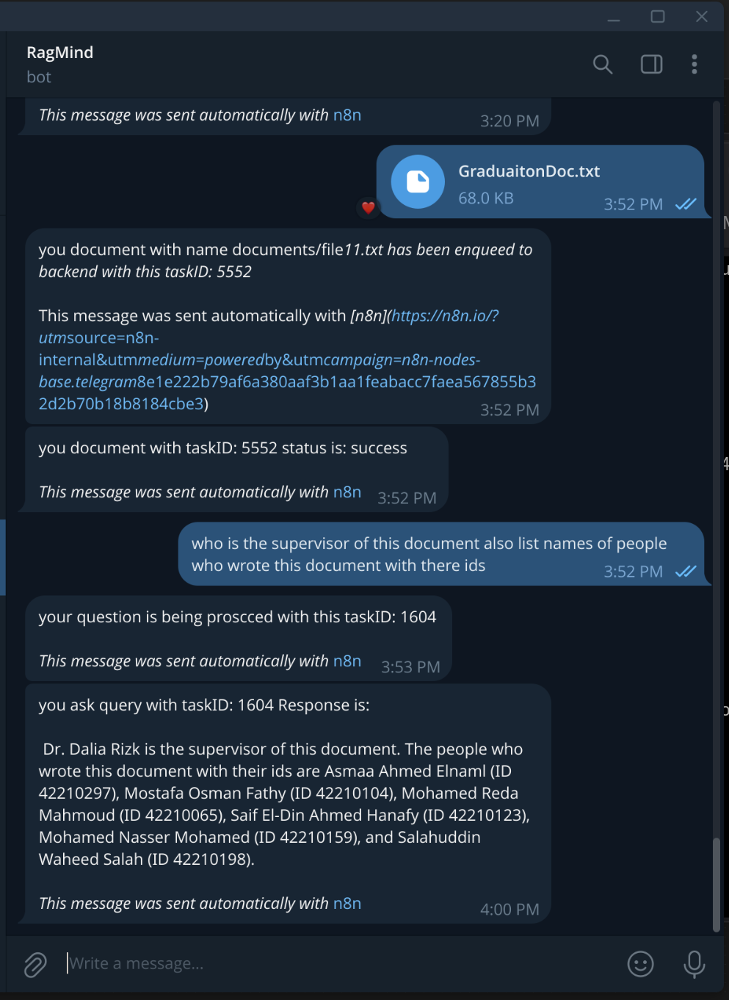
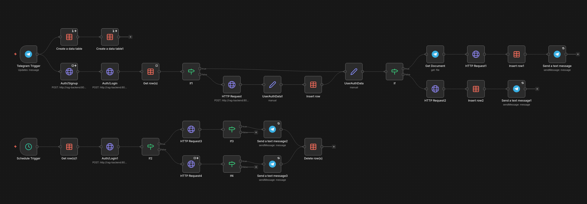

  

# RagMind — n8n Integration README

This README documents the exact n8n workflow used by the RagMind bot integration (Telegram → RAG backend). It was written from the exported workflow JSON you supplied and follows the live node names and behavior.

> Source: uploaded workflow JSON. fileciteturn1file0

---
## telegram sample

* Telegram messages (text & documents) arrive via a single `Telegram Trigger`.
* New users are signed-up then logged-in against the RAG backend (`Auth/Signup` → `Auth/Login`).
* Two main paths:

  * **Document**: download file (`Get Document`) → upload to backend (`HTTP Request1`) → enqueue a document task (insert to `Tasks`) → notify user.
  * **Query**: forward text to the backend ask endpoint (`HTTP Request2`) → insert a short-poll task → notify user.
* A scheduled workflow runs every **3 seconds** (`Schedule Trigger`) to read `Tasks`, poll backend task endpoints, send responses and remove finished tasks.
* Two data tables are created on first-run: `users` and `Tasks` (`Create a data table`, `Create a data table1`).

## n8n telegram flow

---

## Files / Source

The README was generated from the exported workflow JSON you provided (RagMind). fileciteturn1file0

---

## Workflow (step-by-step)

### Incoming message (main entry)

1. `Telegram Trigger` — receives updates (messages/documents).
2. The flow executes `Auth/Signup` (POST `/auth/signup`) using the Telegram `from` data to create a user record in the backend. `Auth/Signup` passes into `Auth/Login`.
3. `Auth/Login` (POST `/auth/login`) logs the user and returns `accessToken` / `refreshToken` which are used in later requests.
4. `Create a data table` and `Create a data table1` nodes are wired from the trigger and are set to `executeOnce` — they create the `users` and `Tasks` tables on first run so deployment is idempotent.

### User data & collection creation

5. `Get row(s)` checks if the user is already in the local `users` table (by `email`).
6. If not present (`If1`), the flow calls `HTTP Request` (POST `/rag/collection`) to create a collection for the user using their Telegram username. The response is written to `UserAuthData1` which then inserts the row in the `users` data table (`Insert row`).

### Document path

7. If the incoming message contains a document (`If` checks `message.document`):

   * `Get Document` downloads the file from Telegram.
   * `HTTP Request1` posts the file to the backend endpoint `/rag/collection/{collectionName}/documents` as multipart/form-data (uses `UserAuthData`'s access token).
   * The backend response should return a `taskId` — the workflow inserts a row into the `Tasks` data table (`Insert row1`) with `isDocumentTask: true` and `taskId`, and then sends `Send a text message` to the user with the task ID.

### Query path (text messages)

8. If the message is a text query (no `document`):

   * `HTTP Request2` posts `{"question": "..."}` to `/rag/collections/{collectionName}/queries/ask` using the user token.
   * The response should include a `taskId` for the async query; `Insert row2` saves a task with `isDocumentTask: false`.
   * `Send a text message1` notifies the user that the question is being processed with the task ID.

### Polling (every 3 seconds)

9. `Schedule Trigger` (3s interval) → `Get row(s)1` reads all rows from `Tasks`.
10. For each task row:

    * `Auth/Login1` logs in with the stored `email`/`password` fields (so the schedule has a valid access token for the user).
    * `If2` splits the path by `isDocumentTask` boolean:

      * **Document task →** `HTTP Request3` calls `/rag/collection/{collectionId}/documents/taskId/{taskId}` to fetch the document processing `result`/status.
      * **Query task →** `HTTP Request4` calls `/rag/collections/{collectionId}/queries/taskId/{taskId}` to fetch the query result.
11. If the returned status/result is not `processing` and not empty (checked by `If3` / `If4`):

    * `Send a text message2` / `Send a text message3` sends the result back to the chat ID stored in the `Tasks` row.
    * `Delete row(s)` removes the task from the `Tasks` table.

---

## Data tables

* **users** (created by `Create a data table`): stores `email`, `accessToken`, `refreshToken`, `collectionName`.
* **Tasks** (created by `Create a data table1`): stores `taskId`, `isDocumentTask` (boolean), `chatId`, `email`, `password`, `collectionId`.

These tables are the lightweight state used by n8n to track and poll tasks without an external database.

---

## Important node names & endpoints

* `Auth/Signup` — POST `/auth/signup`
* `Auth/Login` / `Auth/Login1` — POST `/auth/login`
* `HTTP Request` — POST `/rag/collection` (create collection)
* `HTTP Request1` — POST `/rag/collection/{collectionName}/documents` (multipart file upload)
* `HTTP Request2` — POST `/rag/collections/{collectionName}/queries/ask` (submit question)
* `HTTP Request3` — GET `/rag/collection/{collectionId}/documents/taskId/{taskId}` (document status)
* `HTTP Request4` — GET `/rag/collections/{collectionId}/queries/taskId/{taskId}` (query result)

Node names above match those in the exported workflow and were kept to make debugging and maintenance easier. For the full exported node content see the workflow JSON you provided. fileciteturn1file0

---

## Environment / Deployment notes

* Replace the hardcoded `http://rag-backend:8080` base URL with an environment variable (e.g. `RAG_BACKEND_URL`) in the workflow to allow different environments (dev/staging/prod).
* Keep the Telegram bot token/credentials in n8n credentials (do **not** commit them to git).
* The `Create a data table` (`executeOnce`) nodes guarantee the `users` and `Tasks` tables exist after first activation — this avoids manual table creation after redeploy.
* Ensure n8n persistence (Docker volume) is configured so the data tables survive restarts.

---

## Security & privacy

* The `Tasks` table stores a `password` field that currently holds `Telegram message.from.id` — treat this as sensitive and consider removing or rotating it if not strictly required by the backend.
* Do not commit tokens or secrets to the repository. Use n8n credentials or environment variables.
* Consider expiring stored `accessToken`s and re-authenticating if a 401 occurs.

---

## Troubleshooting

* If tasks never finish: check backend endpoints `/queries/taskId/{taskId}` and `/documents/taskId/{taskId}` return expected `result`/status. The workflow expects `processing` string while running.
* If users are duplicated in `users` table: ensure `Get row(s)` filter by `email` matches the login email format (currently `username@bot.rag.telegram`).
* If uploads fail: confirm `HTTP Request1` uses `contentType: multipart-form-data` and provides binary input named `data` from `Get Document`.

---

## Next improvements (recommended)

* Replace short polling with backend webhooks when possible to reduce load and latency.
* Move backend base URL and polling interval into variables.
* Add retry + exponential backoff for transient HTTP errors.
* Remove storing `password` in plain text and use a refresh-token flow if possible.

---

### Contact

Mostafa Osman — [mostafa.osman.fathi@gmail.com](mailto:mostafa.osman.fathi@gmail.com)

(README generated from your uploaded workflow JSON.)
